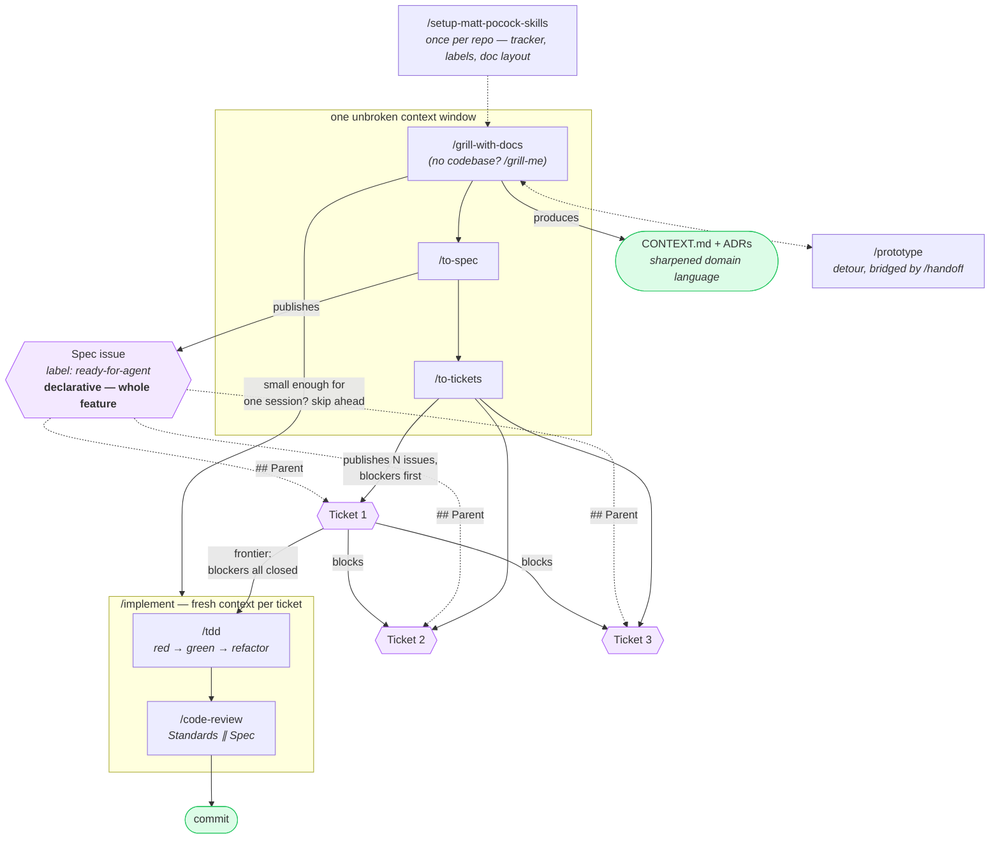

# Matt Pocock's engineering skills — the main flow

Verified against [`mattpocock/skills`](https://github.com/mattpocock/skills) @ `main`.
Source of truth for the flow itself: [`skills/engineering/ask-matt/SKILL.md`](https://github.com/mattpocock/skills/blob/main/skills/engineering/ask-matt/SKILL.md).

## The corrected graph

## What the tickets actually look like

Not a tree. A **DAG of blocking edges**, published one issue per ticket in dependency
order, using GitHub's native issue dependencies (`blocked_by`). You work **the
frontier** — any ticket whose blockers are all closed.

Each ticket is a **tracer bullet**: a narrow but complete vertical path through every
layer (schema → API → UI → tests), demoable on its own, sized to fit one fresh context
window.

## Vocabulary check

| Term in the drawing | Verdict | What the repo actually says |
| --- | --- | --- |
| Tracking Issue (from `/to-spec`) | close enough | It's a **spec issue** (a PRD). "Tracking issue" isn't repo vocabulary, but it does become the `## Parent` the tickets point back at. |
| Tracking Issue (from `/to-tickets`) | ✗ | `/to-tickets` creates **no** parent. It publishes N sibling issues that reference the spec issue from the previous step. |
| Sub-Issues | ✗ | Tickets are siblings joined by **blocking edges**. Native sub-issue links are used only "where the platform has one"; the canonical relationship is `blocked_by`. `sub-issue` as a first-class concept belongs to `/wayfinder`, a different flow. |
| Declarative Goals | ✓ | Spec is Problem / Solution / User Stories / Implementation Decisions, "no specific file paths or code snippets". |
| Imperative Instructions | ✗ | Tickets stay declarative: "the end-to-end behaviour this ticket makes work, from the user's perspective — **not** a layer-by-layer implementation list", and the same no-file-paths rule applies. The spec→ticket gradient is **scope**, not declarative→imperative. |

## Context hygiene — the rule with no shape on a graph

- Keep grilling → `/to-spec` → `/to-tickets` in **one unbroken context window**. Don't
  compact or clear until after `/to-tickets`.
- Each `/implement` then starts **fresh**, working from the ticket alone.
- The ceiling is the **smart zone** (~120k tokens). Approaching it before `/to-tickets`
  means `/handoff` to a new thread — not pushing on degraded.
